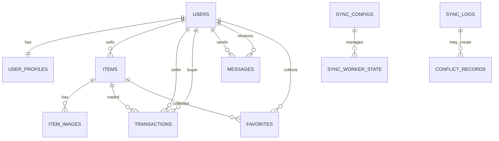

# 《数据库系统实践》实验报告：异构多活分布式数据库同步与冲突处理系统

- 课程：数据库系统实践
- 题目：异构多活分布式数据库同步与冲突处理系统（基于校园二手交易业务）
- 日期：2026-01-04
- 作者：刘晨杰

---

## 摘要

本实验面向“多数据库实时/定时同步与冲突处理”的课程任务，设计并实现了一套运行于 Docker Compose 的异构多活数据库同步系统：两端边缘业务库（MariaDB、PostgreSQL）就近承载 OLTP 读写，云端/总库（MySQL Hub）作为汇聚库与协调中心承载同步核心、冲突记录与管理端复杂分析查询（OLAP）。系统采用应用层雪花 ID 解决多主写入主键冲突，使用应用层向量时钟 `v_clock` 判定同步覆盖与并发冲突，并通过边缘触发器捕获行级变更快照写入 `sync_log`，由 Hub 侧 Sync Core Worker 轮询消费、跨库复制写入、冲突落库（`conflict_records`）与通知（邮件/链接认证），最终在管理端完成冲突查看与人工处理闭环。针对管理端高级查询场景，设计组合索引并提供 explain/benchmark 验证优化效果。

关键词：异构数据库；多活；触发器；同步日志；向量时钟；冲突检测；雪花 ID；索引优化；Docker

---

## 目录

- [1. 需求分析与实验要求对照](#1-需求分析与实验要求对照)
- [2. 系统总体架构设计](#2-系统总体架构设计)
- [3. 数据库设计与规范化](#3-数据库设计与规范化)
- [4. 变更捕获与同步机制](#4-变更捕获与同步机制)
- [5. 冲突检测、通知与处理闭环](#5-冲突检测通知与处理闭环)
- [6. 高级查询与性能优化（索引）](#6-高级查询与性能优化索引)
- [7. 安全与权限管理](#7-安全与权限管理)
- [8. 系统部署、运行与演示步骤](#8-系统部署运行与演示步骤)
- [9. 总结与展望](#9-总结与展望)

---

## 1. 需求分析与实验要求对照

### 1.1 业务需求（以校园二手交易为载体）

系统选择“校园二手交易”作为真实业务场景，覆盖典型的多表关系与高并发写入：

- 用户：注册/登录、个人资料、权限与角色
- 商品：发布/浏览/搜索、图片
- 交易：订单/完成状态、评价
- 消息：站内沟通
- 收藏：用户收藏商品
- 管理端：冲突处理、同步状态与统计、复杂查询与性能对比

选择该业务的原因：

- 具备足够丰富的实体关系，满足 ER 建模和多表约束要求；
- 存在典型写入热点（商品更新、交易状态变更），适合展示“多主写入 + 同步 + 冲突”问题；
- 管理端复杂查询可展示 JOIN/聚合/子查询与索引优化。

### 1.2 实验要求对照（任务书）

> 以下对照点来自《数据库系统实践》任务书，结合本项目实现给出验证方式。

1) **不少于三种数据库系统**：MySQL（Hub）+ MariaDB（Edge North）+ PostgreSQL（Edge South）。
- 验证：`docker compose up -d` 后可见三库容器运行。

2) **所有数据库表结构一致**：核心业务表字段、主键类型（雪花 BIGINT）与同步元字段（如 `v_clock`）保持一致。
- 验证：三库初始化 SQL 统一、业务表结构一致；同步依赖统一的字段集合。

3) **不少于 5 张表**：覆盖 `users / user_profiles / items / item_images / transactions / messages / favorites` 等。
- 验证：数据库 schema 与后端 ORM 模型。

4) **包含用户管理及权限管理**：提供用户/角色/权限模型与管理端访问控制。
- 验证：管理端页面与后端鉴权依赖（登录态、角色权限）。

5) **提供复杂 SQL 查询页面 + 数据库端优化**：管理端“高级查询”包含多表连接、子查询/CTE、聚合统计，并通过组合索引提升性能。
- 验证：管理端提供 SQL 预览、执行与 explain/benchmark 对比。

6) **同步保持各表数据一致**：通过 Edge 触发器记录变更，Hub Worker 消费同步日志并复制写入目标库。
- 验证：在 Edge 写入后观察 Hub/另一 Edge 数据变化。

7) **支持实时、定时两种同步方式**：Hub 使用 `sync_configs` 维护同步模式（`realtime/scheduled`）与周期。
- 验证：修改 `sync_configs` 后观察同步行为变化与日志输出。

8) **冲突邮件通知管理员**：检测并发冲突后写入 `conflict_records`，并（在 SMTP 配置可用时）发送邮件通知。
- 验证：制造并发更新，观察 Worker 日志与冲突记录；邮件功能依赖 SMTP 环境。

9) **链接中包含身份认证信息，移动端/PC 均可查看冲突**：系统生成带过期时间的 token（purpose=admin_ui）嵌入链接，后端验证 token 后返回冲突详情。
- 验证：打开通知链接进入冲突详情；同一链接在移动端/PC 浏览器均可访问。

10) **PC 端可处理冲突（选择以哪个库为准）**：管理端提供冲突列表与处理操作，选择 source/target 或手动策略并回写同步。
- 验证：管理端处理后冲突标记 resolved，同步写回目标库。

11) **移动端查看每天同步情况分析报表（图形方式）**：管理端/移动端页面提供同步统计数据与图形化展示。
- 验证：访问管理端统计卡片/图表页面。

此外：

- **服务端接口 + Docker 部署**：gateway（FastAPI）+ sync-worker + 三库 + 前端均容器化。
- **第三方接口调用**：邮件通知属于外部 SMTP 服务调用；系统也可扩展更多外部接口。
- **Git 版本管理**：源码、SQL、文档材料均可通过 Git 提交与拉取。

---

## 2. 系统总体架构设计

### 2.1 架构目标

- 就近访问：本部/南校区用户优先访问本校区边缘库，降低写入延迟；
- 容灾与汇聚：Hub 汇聚全量数据用于备份与全局分析；
- 可解释的一致性：基于向量时钟判定覆盖/冲突，明确冲突闭环；
- 兼容异构：不依赖数据库原生复制，使用应用层同步适配 MariaDB/PostgreSQL/MySQL。

### 2.2 拓扑与节点角色

- **Edge North（MariaDB）**：读写主库（Master A），`WorkerID=1`，负责本部用户 OLTP。
- **Edge South（PostgreSQL）**：读写主库（Master B），`WorkerID=2`，负责南校区用户 OLTP。
- **Central Hub（MySQL）**：汇聚库/协调中心（Warehouse/Coordinator），`WorkerID=0`，承载：
  - 同步核心（Sync Core Worker）
  - 同步配置（`sync_configs`）与游标（`sync_worker_state`）
  - 冲突记录（`conflict_records`）与管理端分析查询（OLAP）

### 2.3 系统组件与职责

- **frontend**：Vue 管理端与用户端页面；
- **gateway**：FastAPI 网关，提供业务 API 与管理 API；
- **sync-worker**：运行 `apps.services.sync_core_worker`，消费边缘 `sync_log` 并执行跨库复制、冲突判定与通知；
- **databases**：三种异构数据库容器。

### 2.4 架构示意图（Mermaid）

```mermaid
flowchart TB
  subgraph EdgeN[Edge North（本部）]
    NDB[(MariaDB)]
    NTR[Trigger: write sync_log + bump v_clock]
    NDB --> NTR
  end

  subgraph EdgeS[Edge South（南校）]
    SDB[(PostgreSQL)]
    STR[Trigger: write sync_log + bump v_clock]
    SDB --> STR
  end

  subgraph Hub[Central Hub（云端）]
    HDB[(MySQL Hub)]
    Worker[Sync Core Worker\n- poll sync_log\n- compare v_clock\n- upsert/delete\n- conflict_records + notify]
    HDB <--> Worker
  end

  UI[Frontend\n(User + Admin Console)] --> API[Gateway (FastAPI)]
  API --> NDB
  API --> SDB
  API --> HDB

  NTR --> Worker
  STR --> Worker
  Worker --> NDB
  Worker --> SDB
```

---

## 3. 数据库设计与规范化

### 3.1 实体与关系（核心业务表）

系统核心实体包括：用户、用户资料、商品、商品图片、交易、消息、收藏；并在 Hub 上引入同步与冲突相关表。



### 3.2 主键策略：雪花 ID（BIGINT）

为避免双主写入产生主键冲突，业务主键采用应用层雪花算法生成 64 位整数：

- 组成：`1位符号 + 41位时间戳 + 10位机器ID + 12位序列号`
- 本部/南校区采用不同的 WorkerID（1/2），Hub 为 0
- 优点：全局唯一、趋势递增（利于索引）、无需 DB 查询即可生成

> 实践经验：前后端交互时，建议将雪花 ID 以字符串传输，避免 JS number 精度丢失导致的路由/查询错误。

### 3.3 同步辅助表设计

- `sync_log`（Edge 侧）：记录行级变更快照（INSERT/UPDATE/DELETE），字段含 `table_name/data_id/operation/old_data/new_data/status/occurred_at`。
- `sync_configs`（Hub 侧）：描述同步拓扑（source/target）、模式（realtime/scheduled）、周期与开关。
- `sync_worker_state`（Hub 侧）：保存 worker 游标（last_event_id），实现断点续跑。
- `conflict_records`（Hub 侧）：保存冲突的 source/target 快照、状态（resolved）与处理信息。

### 3.4 规范化简述

- 业务表在满足业务功能的前提下进行 1NF～3NF 设计：
  - 用户与用户资料拆分（`users` 与 `user_profiles`）；
  - 商品与图片拆分（`items` 与 `item_images`）；
  - 交易关联用户与商品（`transactions`）；
  - 收藏表为多对多关系的桥接（`favorites`）；
- 同步元字段（如 `v_clock`）作为并发控制/同步判定字段，属于技术字段，不影响实体范式。

---

## 4. 变更捕获与同步机制

### 4.1 边缘库触发器（变更捕获）

在 MariaDB 与 PostgreSQL 的边缘库中，通过触发器实现“变更捕获（CDC）”：

- 对业务表 INSERT/UPDATE/DELETE 触发；
- 写入 `sync_log`，记录变更前后快照；
- 同时维护/递增 `v_clock`，保证即便通过 Navicat 等外部方式改库，也能推动版本前进。

### 4.2 应用层向量时钟（v_clock）

- 结构：每条业务记录包含 `v_clock`（JSON/Text），格式 `{"N":counter,"S":counter}`。
- 含义：N 表示 MariaDB（本部）分量，S 表示 Postgres（南校）分量。

判定规则：

- **支配（dominates）**：若 A 的每个分量都 ≥ B，且至少一个分量 > B，则 A 更新更“新”，可覆盖写入。
- **并发（concurrent）**：若 A 与 B 互不支配，则为并发冲突，需要进入冲突闭环。

### 4.3 Hub 侧 Sync Core Worker（日志消费与复制）

Worker 工作流：

1. 从 Hub `sync_worker_state` 读取游标；
2. 轮询 Edge `sync_log` 中未处理记录（status=0，且 log_id > cursor）；
3. 取出源快照与目标当前行，解析 `v_clock` 判定覆盖/冲突；
4. 覆盖：对目标库执行 upsert/delete；
5. 冲突：写入 Hub `conflict_records`，并触发通知；
6. 标记 edge log 已处理并推进游标。

### 4.4 回环抑制（避免“复制引发复制”）

同步写入目标库时必须抑制目标库触发器，否则会形成无限回环。系统采用会话变量实现：

- MySQL/MariaDB：`SET @sync_suppress = 1`
- Postgres：`SET app.sync_suppress = '1'`

触发器检测到 suppress 标志时跳过写 `sync_log` / 跳过 `v_clock` bump。

### 4.5 异常变更识别与 Smart Fix（概念与落地）

当检测到“业务字段变更但 `v_clock` 未递增”（常见于外部绕过业务写入），Worker 会将其判定为异常变更并进行 smart-fix：

- 在内存中对本源库分量做 +1 修正（如 MariaDB bump N）；
- 回写源库补齐 `v_clock` 后再按正常流程继续同步。

---

## 5. 冲突检测、通知与处理闭环

### 5.1 并发冲突场景

当 Edge North 与 Edge South 近同时修改同一条记录：

- MariaDB 版本：`v_clock={"N":1,"S":0}`
- Postgres 版本：`v_clock={"N":0,"S":1}`

两者互不支配 ⇒ 判定为并发冲突。

### 5.2 冲突落库

Worker 将冲突写入 Hub `conflict_records`，保存：

- `table_name / record_id`
- source/target 两端快照（payload）
- resolved 状态与处理备注

### 5.3 邮件通知与“链接认证”

- 冲突产生时（SMTP 可用）发送邮件通知管理员：包含冲突摘要与处理链接；
- 链接携带短期有效 token（purpose=admin_ui），后端验证 token 后允许查看冲突详情。

### 5.4 管理端处理

管理端提供：

- 冲突列表分页查询；
- 冲突详情对比（source vs target）；
- 处理操作：选择以 source/target 为准或人工策略，回写同步并标记 resolved。

---

## 6. 高级查询与性能优化（索引）

### 6.1 高级查询需求

为满足“复杂 SQL + 优化”的要求，管理端提供高级查询能力，典型特征：

- 多表 JOIN：`users/items/transactions/campuses/categories` 等
- 子查询/CTE：相关子查询统计、预聚合
- 聚合统计：`COUNT/SUM/AVG` + `GROUP BY`

管理端提供：

- SQL 预览（baseline/optimized）；
- 执行与 explain；
- benchmark 对比（耗时对比）。

### 6.2 索引设计

针对查询访问特征新增组合索引（Hub MySQL 为主，同时保持三库 schema 一致）：

- `items(status, category_id, campus_id)`：常见过滤（status）+ 分类/校区聚合；
- `transactions(status, seller_id, final_amount)`：按完成状态过滤 + 卖家维度汇总；
- `conflict_records(table_name, record_id)`：按表过滤 + 精确定位冲突记录。

### 6.3 验证方式

- 使用管理端 explain 查看是否走到组合索引；
- 使用 benchmark 对比优化前后耗时；
- 结合业务数据量增长观察趋势。

---

## 7. 安全与权限管理

- 登录认证：前端携带登录态访问网关 API；
- 角色权限：管理员端操作（如冲突处理、SQL 执行/benchmark）需要授权；
- 链接认证：冲突处理链接携带短期 token，避免裸链接泄露造成越权；
- 审计与可追溯：同步日志与冲突记录持久化，便于排查问题与展示。

---

## 8. 系统部署、运行与演示步骤

### 8.1 Docker Compose 一键启动

前置：安装 Docker / Docker Compose。

```bash
# 从零重建（包含数据库 init.sql 重新生效）
docker compose down -v

# 启动：三库 + 后端网关 + 前端 + 同步 worker
docker compose up -d --build

# 查看日志
docker compose logs -f gateway
docker compose logs -f sync-worker
```

访问入口：

- 前端：`http://localhost:5173`
- 后端 API：`http://localhost:8000`

### 8.2 推荐演示流程（答辩 10 分钟版本）

1. 展示系统架构图与三库容器运行状态；
2. 在 Edge A（MariaDB）发布/修改商品，观察 Hub/Edge B 数据同步；
3. 在两端近同时修改同一记录，制造冲突，展示 `conflict_records` 生成与通知（SMTP 可用则展示邮件）；
4. 打开带 token 的处理链接，进入管理端冲突详情；
5. 选择以某端为准并提交，展示冲突 resolved 与回写同步结果；
6. 进入高级查询页面，展示 baseline/optimized SQL，执行 explain 与 benchmark 对比，说明索引命中与性能提升原因。

---

## 9. 总结与展望

### 9.1 总结

本实验基于真实业务实现了异构多活同步系统，核心贡献在于：

- 通过雪花 ID 解决多主写入主键冲突；
- 通过应用层向量时钟实现可解释的覆盖/冲突判定；
- 通过 Edge 触发器 + Hub 轮询 Worker 完成跨库复制与断点续跑；
- 通过冲突落库、通知、链接认证与管理端处理形成完整闭环；
- 通过高级查询与索引优化满足课程“复杂 SQL + 优化验证”的要求。

### 9.2 展望

- 更完善的 CDC：从轮询升级为更实时的变更流（在保持异构兼容前提下）；
- 更细粒度的 ACK：将 `sync_log.status` 扩展为按 target 维度确认；
- 冲突策略丰富化：增加字段级合并、业务优先级、自动化决策；
- 观测性增强：将同步延迟、成功率、冲突率等指标接入统一监控。
